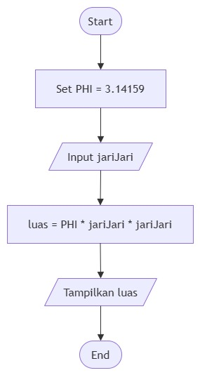

# Pertemuan 1

## PsuedoCode
```
PROGRAM Menghitung_Luas_Lingkaran

PHI : double = 3.14159
jariJari : double
luas : double

PRINT "Masukkan jari-jari lingkaran: "
BACA jariJari

luas = PHI * jariJari * jariJari

PRINT "Luas lingkaran adalah: ", luas
END
```

## Flowchart

